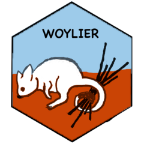

<!-- README.md is generated from README.Rmd. Please edit that file -->

# woylier <a href='https://numbats.github.io/woylier/'></a>


<!-- badges: start -->
<!-- badges: end -->

The "woylier" package provides alternative method for generating a tour path by interpolating between d-D frames in p-D space rather than d-D planes. 


## Installation

You can install the development version of woylier from
[GitHub](https://github.com/) with:

``` r
# install.packages("devtools")
devtools::install_github("numbats/woylier")
```

## More documentation

https://doi.org/10.48550/arXiv.2311.08181
