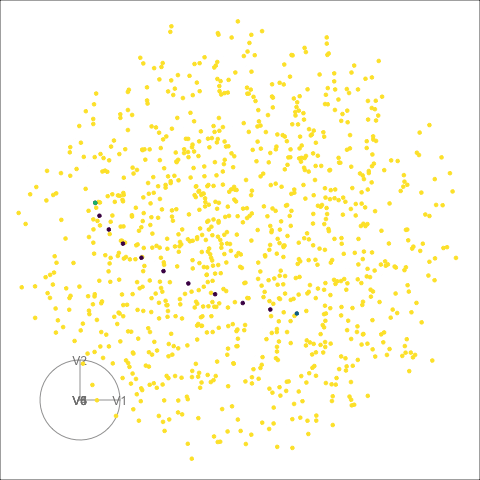
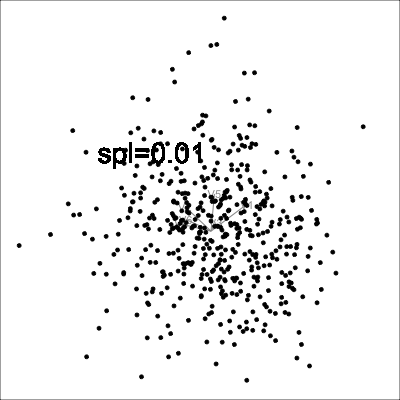

```{r setup, include=FALSE}
knitr::opts_chunk$set(echo = FALSE, warning = FALSE, message = FALSE)
library(tourr)
library(tidyverse)
library(woylier)
library(geozoo)
library(ggplot2)
library(patchwork)
library(gganimate)
```

# Introduction

The idea of projection pursuit is a procedure used to locate the projection of high-to-low dimensional space that expose the most interesting feature of data originally proposed by [@kruskal_1969]. The projection pursuit technique involves a criterion of interest, numerical objective function, and the most interesting projection of data is achieved when the criterion is maximized. In the literature, there are a number of such criterion has been developed based on clustering, spread, and outliers. 

Grand tour is a multivariate data visualization technique developed by [@asimov_1985], which is based on idea of rotations of a lower dimensional projection in high-dimensional space. This technique is equivalent to rotating an object in 3D to better understand its shape and dimensions. Originally, Asimov's grand tour presents the viewer with an automatic movie of projections with no user control. Since then the literature on the tour has been about interactivity of the tour giving the control to users.[@buja_cook_asimov_hurley_2005] One of the interactive visual data exploration tool is "guided tour".

The guided tour gives user an exploration power by combining projection pursuit with tour which is implemented in the "tourr"[@tourr] package. Current implementation of guided tour used geodesic interpolation between planes. 

The interpolated paths based on geodesic interpolation between bases is visually invariant under changes of orientation. However, in some cases of non-linear projection pursuit the orientation of frames does matter. One example is splines2D index.[@pp] The lack of rotation invariance of splines2d index raise complications in the optimization process.[@pp] This rotational variety issue of non-linear projection pursuit functions was the motivation of this work. 

```{r splines2d-static, echo = FALSE, fig.height = 5, fig.cap="The plot on the right hand side is 30 degree rotation of the left hand side. The calculated splines index is shown on top of each plots. Although they depicts the same points we can see that splines index is different which show the rotational variance of splines index.", include=knitr::is_html_output(), eval=knitr::is_html_output(), fig.alt = "Two side by side scatterplots with 6 points. The plot on the right hand side is 30 degree rotation of the left hand side. The calculated splines index is shown on top of each plots. Although they depicts the same points we can see that splines index is different which show the rotational variance of splines index. "}
data("sine_curve")
mat <- data.frame(sine_curve[,5:6])
mat_idx <- round(tourr::splines2d()(mat), 2)
mat_rot <- data.frame(x = cos(pi/6) * sine_curve$V5 + 
                          sin(pi/6) * sine_curve$V6,
                      y = -sin(pi/6) * sine_curve$V5 + 
                           cos(pi/6) * sine_curve$V6)
mat_rot_idx <- round(tourr::splines2d()(mat_rot), 2)
p1 <- ggplot(mat, aes(x=V5, y=V6)) + 
  geom_point() + 
  ggtitle(paste("Splines index = ", mat_idx)) +
  theme(aspect.ratio=1)
p2 <- ggplot(mat_rot, aes(x=x, y=y)) + 
  geom_point() + 
  xlab("Rotated 1") + ylab("Rotated 2") +
  ggtitle(paste("Splines index = ", mat_rot_idx)) +
  theme(aspect.ratio=1)
p1+p2
```

A few alternatives to geodesic interpolation were proposed by [@buja_cook_asimov_hurley_2005]. The purpose of woylier package is to implement Givens paths method. This algorithms adapts Given's matrix decomposition technique that zeros out all but first elements of a vector. 

```{r 2d-path-dynamic, echo = FALSE, fig.height = 3, fig.cap="Interpolation steps of 2D projections of 6D data", include=knitr::is_html_output(), eval=knitr::is_html_output(), fig.alt = "2 highlighted points on the surface of torus connected by 10 interpolated steps, rotating."}

knitr::include_graphics("torus.gif")
```

This article is structured as follows. The next section provided the theoretical framework of Givens interpolation method followed by a section about the implementation Givens path in woylier package that is compatible with current geodesic_path() function of tourr package. Furthermore, we would attempt to apply this interpolation method to projection pursuit of splines index to search for nonlinear associations between variables in example data set. Finally, this article includes a discussion about the limitations.

# Background

The tour method of visualization is animated high-to-low dimensional data rotation that is a movie, one-parameter (time) family of static projections. Several algorithms for such dynamic projections are discussed by [@buja_cook_asimov_hurley_2005] is based on the idea of smoothly interpolating a discrete sequence of projections. 

The topic of this article is the construction of paths of projections. Interpolation of paths of projection can be compared to connecting line segments that interpolate points in Euclidean space. Interpolation acts as a bridge between continuous animation and discrete choice of sequences of projections. Sequence of projections can be constructed in various ways depending on user purpose. If user wants to look at the data from all sides, a random sequence of projections can be used, which is implemented in grand tours. Furthermore, the sequence of projections can be pre-computed, data-driven, or even manually controlled. 

Before continuing with the interpolation algorithms, we need to define the notations. 

- Let the $p$ be the dimension of original data and $d$ be the dimension onto which the data is being projected. 

- A frame $F$ is defined as $p\times d$ matrix with pairwise orthogonal columns of unit length that satisfies, where $I_d$ is the identity matrix in d dimensions. 

$$F^TF = I_d$$ 

- Paths of projections are given by continuous one-parameter families $F(t)$ where $t\in [a, z]$ interval representing time. We denote the starting frame by $F_a = F(a)$ and target frame by $F_z = F(z)$.

**Preprojection algorithm**

The purpose of preprojection is to limit the data subspace $F_a$ and $F_z$ that the interpolated path is traversing so that the interpolation is carried out simply. Simply, it is defining the joint subspace of $F_a$ and $F_z$.

The procedure starts with forming an arbitrary orthonormal basis by applying Gram-Schmidt to $F_z$ with regard to $F_a$. We denote the resulting orthonormal basis of $p\times d_s$ by $B$. 

Now, we can express the original frames in this basis:

$$F_a = BW_a, F_z = BW_z$$

The interpolation problem is then reduced to the construction of paths of frames $W(t)$ that interpolate the projected frames $W_a$ and $W_z$.

**The interpolating paths of plane versus frames**

Current implementation of tourr package[@tourr] is locally shortest (geodesic) interpolation of planes. The pitfall of this interpolation method is that it does not account for rotation variability. However, the interpolation of frames is required when the orientation of projection matters. If the rendering on a frame and on the rotated version of the frame yields the same visual scenes, it means the orientation does not matter. 

The orientation of frames could be important when non-linear projection pursuit function is used in guided tour. An illustration of such cases are shown below.

**Givens rotation**

A rotation matrix is a transformation matrix that is used to perform a rotation in Euclidean space in xy plane. A rotation matrix that transforms 2-D plane by an angle $\theta$ looks like this:

$$ \begin{bmatrix}\cos \theta &-\sin \theta \\\sin \theta &\cos \theta \end{bmatrix} $$

If the rotation is in the plane of variables i and j, it is called Givens rotation. The Givens is useful for introducing zeros on a grand scale and used for computing the QR decomposition of matrix in linear algebra problems. One advantage over other transformation methods which is particularly useful in our case is the ability to zero elements more selectively.

The interpolation methods in the woylier package is based on the fact that in any vector u one can zero out the i-th coordinate with a Givens rotation in the $(i, j)$-plane for any $j\neq i$. This rotation affects only coordinate $i$ and $j$ and leave all other coordinates unchanged. 

**Givens interpolation path algorithm**

We established that the between frames interpolation is necessary when the orientation of the projection matters. There are several methods discussed in the paper including decomposition of orthogonal matrices, Givens decomposition and Householder decomposition. One that is of interest to us is Givens path.

Sequences of Givens rotations can map any orthonormal d-frame F in p-space to standard d-frame $E_d=((1, 0, 0, ...)^T, (0, 1, 0, ...)^T, ...)$. 

The interpolation path construction algorithm from starting frame $F_a$ to target frame $F_z$ is illustrated below. The example is 2D path construction process of original 6D data frame. 

1. Construct preprojection basis $B$ by orthonormalizing $F_z$ with regards tp $F_a$ with Gram-Schmidt:

$$B = (F_a, F_{\star})$$


$F_a$ and $F_z$ are $p\times d$ or $6\times2$ matrices that are orthonormal. The preprojection basis $B$ is $p\times 2d$ matrix that is $6\times 4$ in our example.


2. Get the preprojected frames using the preprojection basis $B$.
$$W_a = B^TF_a = E_d$$ and $$W_z = B^TF_z$$
Since $B$ is orthonormalized basis of $F_z$ with regard to $F_a$, $W_a$ is $2d\times d$ matrix of 1, 0s by construction that looks like in our example:


$$ \begin{bmatrix}1 & 0 \\0  &1 \\ 0&0 \\0&0\end{bmatrix} $$

$W_z$ is orthonormal $2d\times d$ matrix that looks like:

$$ \begin{bmatrix} a_{11} & a_{12} \\a_{21}  &a_{22} \\ a_{31}&a_{32} \\a_{41}&a_{42}\end{bmatrix} $$


3. Then, we can construct a sequence of Givens rotations that maps $W_z$ to $W_a$:

$$ W_a = R_m(\theta_m) ... R_2(\theta_2)R_1(\theta_1)W_z$$ 

At each rotation, the angle $\theta_i$ that zero out the second coordinate of a plane is calculated.

When $d = 2$, there are 5 rotations involved with 5 different angles that makes each elements 0. For example, the first rotation angle $\theta_1$ is an angle between $(1, 0)$ and $(a_{11}, a_{21})$. This rotation matrix would make element $a_{21}$ zero:

$$R_1(\theta_1) = G(1, 2, \theta_1) = \begin{bmatrix} cos\theta_1 & -sin\theta_1 & 0 & 0 \\sin\theta_1  &cos\theta_1 & 0 &0 \\ 0&0&1&0 \\0&0&0&1\end{bmatrix}$$

4. The inverse mapping is obtained by reversing the sequence of rotations with the negative of the angles, we starts from the starting basis and end at the target basis. 

$$R(\theta) = R_1(-\theta_1) ... R_m(-\theta_m), \    W_z = R(\theta)W_a$$
This step should include the time parameter, $t$, so it shows the interpolation process rendered in the movie-like sequence.

5. Finally, we reconstruct our original frame using $B$. This reconstruction is done at each step of interpolation so we have interpolated path as result.

$$F_t = B * W_t$$

**Projection pursuit index functions**

The properties of several projection pursuit index functions were investigated.[@pp] The smoothness, squintability, flexibility, rotation invariance, and speed of projection pursuit index functions were examined. The one property that is interesting to us is rotation invariance. The rotational invariance is examined by computing projection pursuit index fro different rotations within 2D plane. It is established that the dcor2d, splines2d and TIC index are  not rotationally invariant.

Splines2D index measures nonlinear association between variable by fitting spline model.[@pp] It compares the variance of residuals and the functional dependence is stronger if the index value is larger.

**Sphere and torus**

In order to illustrate the interpolated path of projections we used geozoo[@geozoo] package. 1D basis is plotted on unit sphere, while 2D basis is visualized on torus. The points on the surface of sphere and torus shape are randomly generated by functions from the geozoo[@geozoo] package.

```{r}
d <- sphere.hollow(p = 3, n = 1000)
#d <- sphere.hollow(p = 5, n = 1000)
d <- data.frame(d$points)
#animate_xy(d, axes="off") 
# include gif of the a sphere and torus
```

# Implementation

We implemented each steps mentioned in **Givens interpolation path algorithm** in separate functions and combined them in *givens_full_path()* function. Here is the input and output of each functions and it's descriptions.

| Function     | Input| Output| Description |
|-----|-------------|-------------|-------------|
| preprojection()  | Starting and target frame (Fa, Fz) | B pre-projection px2d matrix | Build a d-dimensional pre-projection space by orthonormalizing Fz with regard to Fa |
| construct_preframe()  | A frame and the pre-projection px2d matrix | Preprojected frame in preprojection space | Construct preprojected frames |
| row_rot()  | Starting and target frame (Fa, Fz) | B pre-projection px2d matrix | Build a d-dimensional pre-projection space by orthonormalizing Fz with regard to Fa |
| calculate_angles()  | Preprojected frames (Wa, Wz) | Names list of angles | Calculate angles of required rotations to map Wz to Wa |
| givens_rotation()  | Wa starting preprojected frame, list of angles of required rotations to map Wz to Wa, stepfraction | Givens path | It implements series of Givens rotations that maps Wa to Wz |
| construct_moving_frame()  | Pre-projection matrix B, Each frame of givens path | A frame of on a step of interpolation | Reconstruct interpolated frames using pre-projection |
| givens_full_path()  | Starting and target frame (Fa, Fz) and number of steps | An array with nsteps matrix. Each matrix is interpolated frame in between starting and target frames. | Construct full interpolated frames. |

# Examples of interpolated paths

In this section we illustrate the use of *givens_full_path()* function by plotting the interpolated path between 2 frames.

**Interpolated paths of 1D projection**

1D projection of data in high dimension is a point. Therefore we can plot the point on the surface of a sphere. The following plot shows the Givens interpolation steps between 2 points, 1D projection of 6D data that is. 

```{r echo = FALSE, include=FALSE}
set.seed(2022)
p <- 6
base1 <- tourr::basis_random(p, d=1)
base2 <- tourr::basis_random(p, d=1)

frames <- givens_full_path(base1, base2, nsteps = 10)

sp <- generate_space_view(p=p)

sp_path <- add_path(sp, frames)

point1 <- as.data.frame(t(base1))
point1$type <- "point1"

point2 <- as.data.frame(t(base2))
point2$type <- "point2"

sp_path <- rbind(sp_path, point1, point2)

tourr::render_gif(sp_path[,1:p], 
                  tour_path = grand_tour(),
                  display = display_xy(axes="bottomleft", col=sp_path$type),
                  frames = 100,
                  "sphere.gif")
```

```{r 1d-path-dynamic, echo = FALSE, fig.height = 3, fig.cap="Interpolation steps of 1D projections of 6D data", include=knitr::is_html_output(), eval=knitr::is_html_output(), fig.alt = "2 highlighted points on the surface of sphere connected by 10 interpolated steps, rotating."}

```


**Interpolated paths of 2D projection**

In case of 2D projections, we can plot the interpolated path between 2 frames on the surface of torus. 

```{r echo = FALSE, include=FALSE}
set.seed(2022)
p <- 6
n <- 1500
d <- 2
base1 <- tourr::basis_random(p, d=2)
base2 <- tourr::basis_random(p, d=2)
frames_2d <- givens_full_path(base1, base2, 10)
proj_2d <- map(1:n, ~basis_random(n = p,  d=d)) %>%
  purrr::flatten_dbl() %>% 
  matrix(ncol = p*2, byrow = TRUE) %>%
  as_tibble()
path_2d <- t(apply(frames_2d, 3, c)) %>% 
  as.data.frame()
proj_2d <- proj_2d %>% 
  mutate(type="torus")
path_2d <- path_2d %>% 
  mutate(type="path")
proj_path <- bind_rows(proj_2d, path_2d)

tourr::render_gif(proj_path[,1:6], 
                  tour_path = grand_tour(),
                  display = display_xy(axes="bottomleft", col=proj_path$type),
                  frames = 100,
                  "torus.gif")
```

```{r 2d-path-dynamic, echo = FALSE, fig.height = 3, fig.cap="Interpolation steps of 2D projections of 6D data", include=knitr::is_html_output(), eval=knitr::is_html_output(), fig.alt = "2 highlighted points on the surface of torus connected by 10 interpolated steps, rotating."}

knitr::include_graphics("torus.gif")
```


# Comparison of geodesic interpolation and Givens interpolation

This is Givens interpolation

```{r echo = FALSE, include=FALSE}
# Generate a sample interpolation
set.seed(5543)
base1 <- tourr::orthonormalise(tourr::basis_random(6, d=2))
base2 <- matrix(c(0, 0, 0, 0, 0, 0, 0, 0, 1, 0, 0, 1), ncol=2, byrow=T)
sine_path <- givens_full_path(base1, base2, nsteps=100)
sine_all <- NULL
sine_proj <- NULL
for (i in 1:dim(sine_path)[3]) {
  d <- as.matrix(sine_curve) %*% as.matrix(sine_path[,,i])
  d <- data.frame(d)
  d$idx <- round(tourr::splines2d()(d), 2)
  d$frame <- i
  sine_all <- bind_rows(sine_all, d)
  prj <- as.data.frame(sine_path[,,i])
  prj$frame <- i
  prj$names <- colnames(sine_curve)
  sine_proj <- bind_rows(sine_proj, prj)
}
sine_label <- sine_all %>%
  mutate(labelX = -1, labelY = 1.45, label_idx = paste0("spl=", format(idx, digits=2)))
sine_proj <- sine_proj %>%
  mutate(cx = 0, cy = 0)
# With gganimate

sine_anim <- ggplot() +
  geom_segment(data=sine_proj, aes(x=V1, y=V2,
                                   xend=cx, yend=cy,
                                   group=frame),
               colour="grey60") +
  geom_text(data=sine_proj, aes(x=V1, y=V2,
                                label=names,
                                group=frame),
               colour="grey60") +
  geom_point(data=sine_label, aes(x=X1, y=X2)) +
  geom_text(data=sine_label, aes(x=labelX, y=labelY,
                label=label_idx), size=10) +
  xlab("") + ylab("") +
  transition_time(frame) +
  theme_void() +
  theme(aspect.ratio=1,
        plot.background = element_rect(fill=NULL, colour = "black"))

animate(sine_anim, fps=8, renderer = gifski_renderer(loop = FALSE), width=400, height=400)
anim_save("sine_anim.gif")
```

```{r givens-path, echo = FALSE, fig.height = 3, fig.cap="Givens interpolation path to target frame", include=knitr::is_html_output(), eval=knitr::is_html_output(), fig.alt = "Data rotating to sine curve."}


```

This is geodesic interpolation 

```{r eval=FALSE}
library(tourr)
set.seed(5543)
base1 <- tourr::orthonormalise(tourr::basis_random(6, d=2))
base2 <- matrix(c(0,0,0,0,0,0,0,0,1, 0, 0, 1), ncol = 2, byrow = TRUE)
basis_set <- array(dim = c(6,2,2))
basis_set[,,1] <- base1
basis_set[,,2] <- base2
attr(basis_set, "class") <- c("history_array", class(basis_set))
path_geo <- tourr::interpolate(basis_set, angle = 0.01)
data("sine_curve")

#sine_curve <- as.matrix(sine_curve)

#geo_path <- save_history(sine_curve[, 1:6], guided_tour(splines2d, max.tries = 100), max_bases = 5)

#sine_path <- givens_full_path(base1, base2, nsteps=100)
sine_all <- NULL
sine_proj <- NULL
for (i in 1:dim(path_geo)[3]) {
  d <- as.matrix(sine_curve) %*% as.matrix(path_geo[,,i])
  d <- data.frame(d)
  d$idx <- round(tourr::splines2d()(d), 2)
  d$frame <- i
  sine_all <- bind_rows(sine_all, d)
  prj <- as.data.frame(path_geo[,,i])
  prj$frame <- i
  prj$names <- colnames(sine_curve)
  sine_proj <- bind_rows(sine_proj, prj)
}
sine_label <- sine_all %>%
  mutate(labelX = -1, labelY = 1.45, label_idx = paste0("spl=", format(idx, digits=2)))
sine_proj <- sine_proj %>%
  mutate(cx = 0, cy = 0)
# With gganimate

```


# Conclusion

The R package **woylier** provides implementation of Givens interpolation path algorithm that can be used as an alternative interpolation method for tour. The algorithm implemented in the **woylier** package comes from [@buja_cook_asimov_hurley_2005]. We illustrate the use of the functions provided in the package for R users.

The motivation to develop this package comes from rotational invariance problem of current geodesic interpolation algorithm implemeneted in **tourr** package[@tourr]. The package gives users the ability to detect non-linear association between variables more precisely. 

It is important to mention that **woylier** package should be integrated with **tourr** package[@tourr]. The future improvements that needs to be done in the package is to generalize the interpolation for more than 2d projections of data.


```{r, include=FALSE}
library(plotly)
library(ggplot2)
library(palmerpenguins)
```

# Introduction

Interactive data graphics provides plots that allow users to interact them. One of the most basic types of interaction is through tooltips, where users are provided additional information about elements in the plot by moving the cursor over the plot.

This paper will first review some R packages on interactive graphics and their tooltip implementations. A new package \CRANpkg{ToOoOlTiPs} that provides customized tooltips for plot, is introduced. Some example plots will then be given to showcase how these tooltips help users to better read the graphics. 

# Background

Some packages on interactive graphics include \CRANpkg{plotly} [@plotly] that interfaces with Javascript for web-based interactive graphics, \CRANpkg{crosstalk} [@crosstalk] that specializes cross-linking elements across individual graphics.  The recent R Journal paper \CRANpkg{tsibbletalk} [@RJ-2021-050] provides a good example of including interactive graphics into an article for the journal. It has both a set of linked plots, and also an animated gif example, illustrating linking between time series plots and feature summaries.

# Customizing tooltip design with \pkg{ToOoOlTiPs}

\pkg{ToOoOlTiPs} is a packages for customizing tooltips in interactive graphics, it features these possibilities.

# A gallery of tooltips examples

The \CRANpkg{palmerpenguins} data [@palmerpenguins]  features three penguin species which has a lovely illustration by Alison Horst in Figure \@ref(fig:penguins-alison). 

```{r penguins-alison, out.width = "100%", out.height = "30%", fig.cap = "Artwork by \\@allison\\_horst", fig.alt="A picture of three different penguins with their species: Chinstrap, Gentoo, and Adelie. "}
knitr::include_graphics("penguins.png")
```

Table `r knitr::asis_output(ifelse(knitr::is_html_output(), '\\@ref(tab:penguins-tab-interactive)', '\\@ref(tab:penguins-tab-static)'))` prints at the first few rows of the `penguins` data:

```{r penguins-tab-interactive, eval = knitr::is_html_output(), layout = "l-body-outset"}
knitr::kable(head(penguins), format = "html", caption = "A basic table")
```

```{r penguins-tab-static, eval = knitr::is_latex_output()}
knitr::kable(head(penguins), format = "latex", caption = "A basic table") %>% 
  kableExtra::kable_styling(font_size = 7)
```   

Figure `r knitr::asis_output(ifelse(knitr::is_html_output(), '\\@ref(fig:penguins-plotly)', '\\@ref(fig:penguins-ggplot)'))` shows an `r ifelse(knitr::is_html_output(), 'interactive', '')` plot of the penguins data, made using the `r knitr::asis_output(ifelse(knitr::is_html_output(), '\\CRANpkg{plotly}', '\\CRANpkg{ggplot2}'))` package. 

```{r penguins-plotly, echo = TRUE, fig.height = 5, fig.cap="A basic interactive plot made with the plotly package on palmer penguin data. Three species of penguins are plotted with bill depth on the x-axis and bill length on the y-axis. When hovering on a point, a tooltip will show the exact value of the bill depth and length for that point, along with the species name.", include=knitr::is_html_output(), eval=knitr::is_html_output(), fig.alt = "A scatterplot of bill length against bill depth, both measured in millimetre. The three species are shown in different colours and loosely forms three clusters. Adelie has small bill length and large bill depth, Gentoo has small bill depth but large bill length, and Chinstrap has relatively large bill depth and bill length."}
p <- penguins %>% 
  ggplot(aes(x = bill_depth_mm, y = bill_length_mm, 
             color = species)) + 
  geom_point()
ggplotly(p)
```

```{r penguins-ggplot, echo = TRUE, fig.height = 5, fig.cap="A basic non-interactive plot made with the ggplot2 package on palmer penguin data. Three species of penguins are plotted with bill depth on the x-axis and bill length on the y-axis. Visit the online article to access the interactive version made with the plotly package.", include=knitr::is_latex_output(), eval=knitr::is_latex_output()}
penguins %>% 
  ggplot(aes(x = bill_depth_mm, y = bill_length_mm, 
             color = species)) + 
  geom_point()
```

# Summary

We have displayed various tooltips that are available in the package \pkg{ToOoOlTiPs}. 
